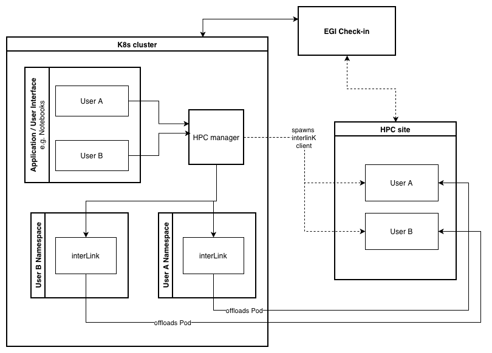

# HPC Pilot

Pilot builds on top of [interLink](https://interlink-project.dev) to manage
cloud-native jobs in HPC appliances for EGI communities through
[Check-in](https://www.egi.eu/service/check-in/).



## Components

- **Cloud**
  - **manager app** — a Flask web application (the `manager/` package) that
    submits HPC jobs, deploys per-user InterLink pods, and talks to Check-in.
  - **InterLink pod** (deployed per user by the manager):
    - interLink API server: REST API for HPC job management.
    - wstunnel server: secure WebSocket tunneling for HPC client connections.
- **HPC**
  - **interLink plugin** — runs on the HPC edge-node on behalf of the interLink
    API server (`echo` / `docker` / `slurm`).
  - **wsTunnel client** — connects to the wstunnel server for API↔plugin
    communication.
- **Check-in** — manages authN/authZ for EGI communities; here used to manage
  user access to both the manager app and the HPC edge-node.

## Repository layout

```
.
├── manager/            # The Flask manager app (lib + api + app layers)
├── charts/             # Helm charts
│   ├── manager/        #   Operator chart that deploys the manager
│   └── interlink/      #   Default values for the per-user InterLink chart
├── documentation/      # All documentation
├── tests/              # Pytest suite (api / app / lib)
├── Dockerfile          # Manager image (root-level)
└── .github/workflows/  # CI: pr / release / test-branch
```

## Documentation

The full documentation lives under [`documentation/`](./documentation/).
Start with:

- [`documentation/README.md`](./documentation/README.md) — web app overview, quick start, file structure.
- [`documentation/deployment.md`](./documentation/deployment.md) — end-to-end deployment guide.
- [`documentation/rest_api.md`](./documentation/rest_api.md) — REST API reference (also browseable at `/api/docs`).

## Cloud

### Manager/Pilot app

The manager orchestrates per-user InterLink pod deployments and handles HPC
job submissions and interactions with Check-in. It provides a UI for users to
submit HPC jobs, monitor their status, and retrieve results, and it manages
the lifecycle of the InterLink pods.

- Go to [`manager/README.md`](./manager/README.md) for app-level details.

### interLink pod

The interLink pod is deployed in the cloud (one per user) and provides the API
and tunnel components needed to connect HPC clients with the manager. All
components run as containers within the pod, talking to each other over
localhost, and the ports are defined in the chart's `values.yaml`.

- Go to [`charts/interlink/README.md`](./charts/interlink/README.md) for details.

#### interLink API server

Provides a RESTful interface for managing HPC jobs. It interacts with the
[interLink plugin](#interlink-plugin) (running on the HPC edge-node) to
schedule and manage jobs, communicating through the wstunnel
([server](#wstunnel-server) and [client](#wstunnel-client)).

#### wsTunnel server

Provides secure WebSocket tunneling for the HPC client to connect to the
InterLink pod from the HPC site. It is exposed on the shared
`site_config.hostname` via **path-prefix routing**: each user's tunnel is
reached at `<hostname>/<namespace>`, so no wildcard DNS or wildcard TLS
certificate is required.

## HPC

### interLink plugin

Runs on the HPC cluster and communicates with the interLink API server. The
plugin to install is selected per HPC node (`manager/hpc/<name>.yaml`): one of
`echo` (test), `docker`, or `slurm`.

### wsTunnel client

Runs on the HPC edge-node and connects to the wstunnel server to create a
secure tunnel, allowing the interLink plugin to communicate with the interLink
API server. Once the tunnel is established, the API/plugin communicate through
"localhost", since the wstunnel and interLink servers share the same IP.

The wstunnel client command template (the manager automates this via
`POST /api/hpc/deploy`):

```
wstunnel client \
    --http-upgrade-path-prefix '<unique-secret>' \
    -R 'tcp://<plugin-port>:localhost:<plugin-port>' \
    ws://<wstunnel-host>:80
```

Where:

- `<unique-secret>`: the user's Kubernetes namespace (e.g.
  `user-a3f1b2c4d5e6f7a8`); must match the `secret` configured in the
  InterLink pod's wstunnel server.
- `<plugin-port>`: the port the interLink plugin listens on (e.g. `4000`).
- `<wstunnel-host>`: the shared site hostname (e.g. `app.example.com`).

## Check-in

Check-in provides authN/authZ for EGI communities, here used to manage user
access to both the Manager app and the HPC edge-node. See
[`documentation/authentication.md`](./documentation/authentication.md).

## Continuous Integration

This repository includes GitHub Actions workflows for the following flows:

- `release.yml` — publishes production artifacts from semantic version tags (`v*.*.*`). It also supports manual triggers via `workflow_dispatch` for ad hoc releases.
- `test-branch.yml` — validates the `test` branch, builds a test Docker image, packages the Helm chart, and uploads chart artifacts for homologation.
- `pr.yml` — runs unit tests (`.venv/bin/python -m pytest tests/`), Helm linting, and a Docker build validation for pull requests, without publishing artifacts.

### Required GitHub settings

- Repository secrets:
  - `GITHUB_TOKEN` (provided automatically by GitHub Actions)

- Recommended workflow permissions:
  - `contents: read`
  - `packages: write` (for image push and registry login on release/test workflows)

### Notes

- The release workflow logs in to `ghcr.io` using `GITHUB_TOKEN` and pushes the manager image.
- The `test` branch workflow builds and pushes a `test-<sha>` image tag and uploads a packaged Helm chart artifact.
- The PR workflow validates the codebase without publishing any Docker or Helm artifacts.

## Roadmap

Items still open from the project backlog (the completed ones — HPC install
support, VO whitelist via `allowed_groups`, automatic `ws`/`wss` protocol
selection — are already shipped):

- Add a `--config` flag for launching the manager with a custom config path.
- Make the InterLink chart version a first-class app-config value.
- Add TLS termination options (beyond the chart's `ingress.tls`).
- Evaluate moving away from the nginx Ingress controller.
- Add an admin/manager whitelist (in addition to the VO `allowed_groups`).
- Support Unix sockets for the wstunnel client.
- Restrict which users may use a given virtual-kubelet node (taints,
  per-HPC and per-user VK nodes tied to VO/`sub`).
